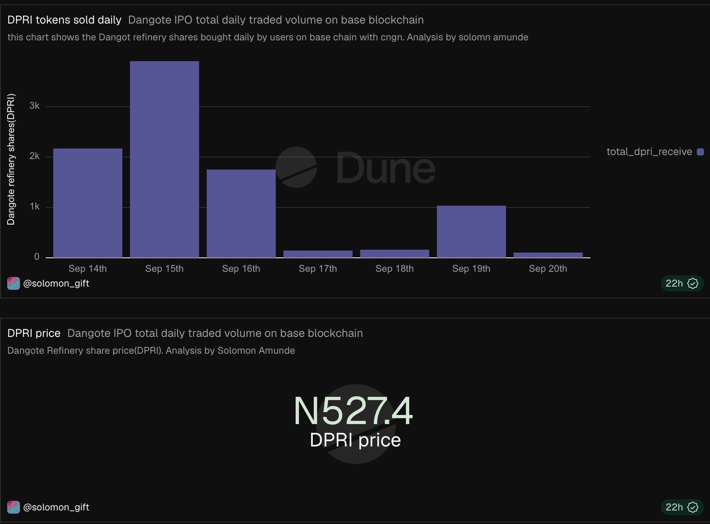
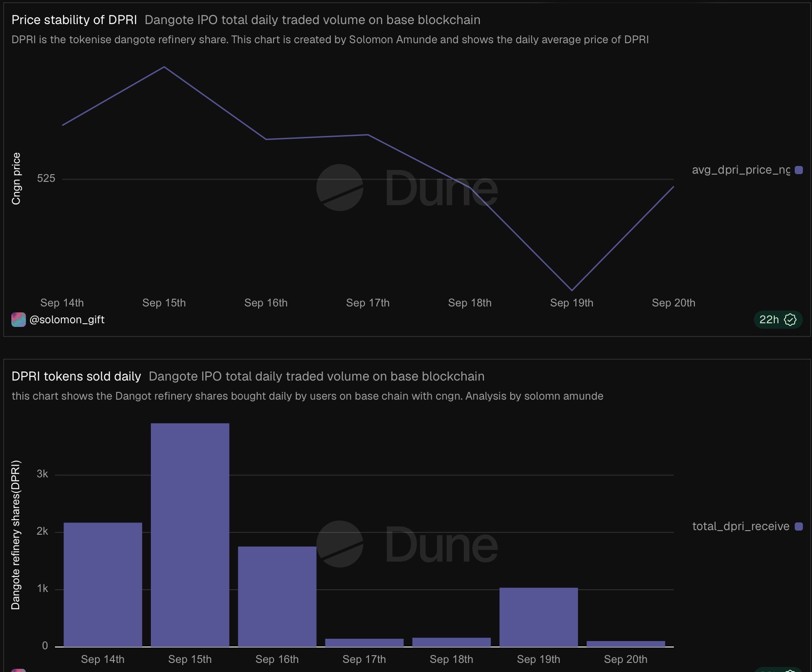
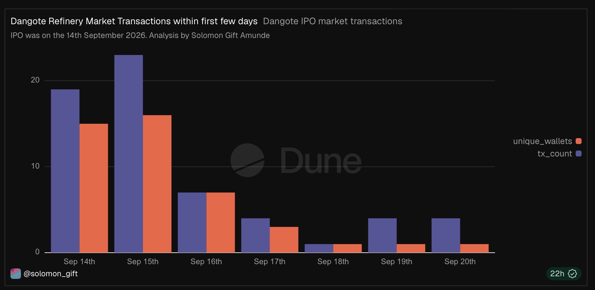
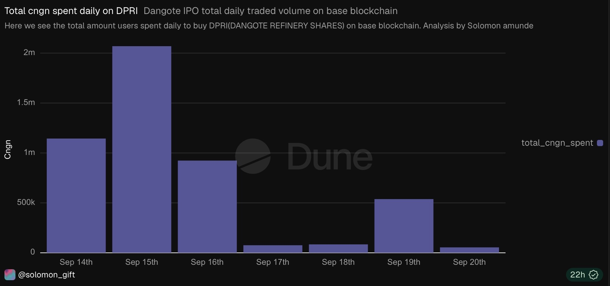
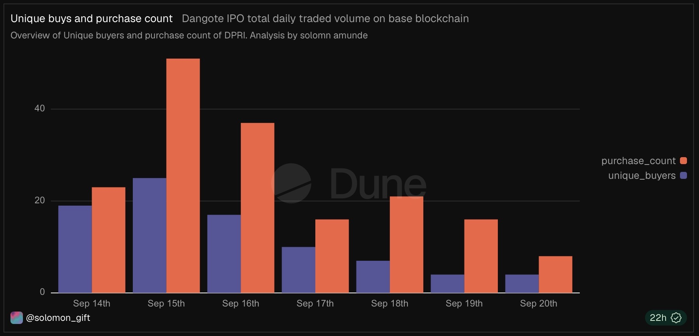

# Dangote IPO Onchain Tracker (DPRI)

## Overview
This dashboard tracks real, onchain participation in the Dangote Petroleum Refinery IPO, tokenized as DPRI and traded on Base blockchain via GetEquity's RWA platform. 

## What it tracks

Wallets receiving DPRI tokens (holder growth)
cNGN spent and DPRI received per transaction, matched by transaction hash
Daily volume and average price, benchmarked against the official ₦525 IPO price
Unique buyer counts and purchase frequency

## Why this matters 

This is one of the first instances of a live African IPO being tracked directly on public blockchain data, independent of any centralized reporting from day 1. All figures here are pulled straight from Base mainnet, no APIs, no self reported numbers.

Analysis done by **Solomon Gift Amunde, Blockchain/Crypto Data analyst and Educator**.

## Live Dashboard
https://dune.com/solomon_gift/onchain-tracker-for-dangote-refinery-ipo-dpri?theme=dark&utm_source=share&utm_medium=copy&utm_campaign=dashboard

## Key Findings
- lots of Nigerians didn’t participate in the dangote IPO on chain compared to reported offchain volume. This could be due to knowledge gap of tokenised stocks/shares
- The number of participants/traders and volume peaked on the second day of the IPO
- It is more accurate and real time tracking tokenised stocks/shares Onchain

## Methodology
This onchain analysis is done on based blockchain where DPRI(tokenised dangote refinery IPO) is deployed.
All data gotten directly from base blockchain
DANGOE REFINERY IPO WAS LAUNCHED 14TH SEPTEMBER 2026

## Charts Screenshots

*Daily Dangote Refinery IPO buys since IPO launch*

*Daily DPRI price action since IPO *

*Total DPRI daily buys since IPO launch*

*Total Cngn spent daily on DPRI purchase since IPO launch*

*Daily total of unique buyers since IPO launch*

